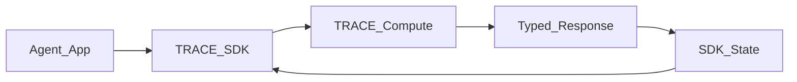

# TRACE API Contract Freeze

This is the v1 freeze target for the TRACE compute and SDK product API. The goal is not to remove existing nuance; the goal is to expose it coherently.

## Contract Principles

1. FastAPI, RunPod, SDK, optional hosted gateway adapters, `/agent-help`, and OpenAPI must describe the same product paths without making the gateway a core runtime dependency.
2. RunPod may keep transport-specific envelopes, but canonical payloads must remain the Pydantic model JSON.
3. Production RunPod product workflows must not depend on server-held session state.
4. Server-held sessions are available only when documented as demo/internal or backed by a durable `SessionStore`.
5. Errors should share one envelope: `code`, `message`, `hint`, `docs_url`, `request_id`, and `retry_after` where relevant.

## Product Paths

The machine-readable freeze source of truth is `api_surface_manifest.json`.
The table below is the human summary; contract checks must use the manifest.

| SDK path | FastAPI path | RunPod action | Canonical response |
|---|---|---|---|
| `client.privacy.redact` | `POST /v1/compliance/redact` | `redact` | `ComplianceRedactionResponse` |
| `client.grounding.rag` | `POST /groundedness` with `scoring_mode=rag` | `score` | `GroundednessResponse` |
| `client.grounding.code` | `POST /groundedness` with `scoring_mode=code` | `score` | `GroundednessResponse` |
| `client.compression.text` | `POST /v1/compression` | `compress` | `CompressionResponse` |
| `client.compression.messages` | `POST /v1/compression` | `compress` | `CompressionResponse` |
| `client.memory.step` | `POST /v1/memory/update` | `memory.update` | `MemoryUpdateResponse` |
| `client.rollup` | `POST /groundedness/rollup` | `rollup` | `RollupResponse` |
| `client.session(...)` SDK facade | stateless product paths | n/a | SDK-managed caller state |
| server sessions | `/v1/trace/sessions/*` | `session.*` | `TraceSession*Response` |

The Python SDK currently exposes `client.session(...)` as a caller-carried state facade for stateless deployments. It does not yet expose the full server-held REST session API as `client.sessions.*`; those routes remain lower-level HTTP/RunPod capabilities until the tenant backend and durable session store are selected.

## Stateless Product Default

The stateless product path for long-running agents is SDK-managed state:

The SDK should store:

- external session id
- event ids and idempotency keys
- latest `MemoryState`
- optional local event buffer
- last trace decision and diagnostics

The compute runtime should store only process-level runtime assets, such as model objects, warm caches, semaphores, metrics, and health state.

## Grounding Contract

`grounding.rag` must preserve:

- effective route/profile/corpus bundle metadata
- fusion weights and thresholds when available
- risk band and risk reason
- support-unit attribution and usage states
- context coverage and unused/uncertain/used ratios
- NLI verdicts and aggregate channels
- structured-source diagnostics
- heatmap data or HTML when requested
- runtime decision record

`grounding.code` must preserve:

- AST parser backend and AST phantom/drift diagnostics
- literal novelty metrics
- composite score and phantom probability/verdict
- NLI cascade diagnostics
- file attribution and dead-weight ratios
- caller-portable code session-state output
- runtime decision record

## RunPod Compatibility

RunPod supports a flat `job.input` transport. The freeze target is:

- `response_format="canonical"` returns the canonical model dump.
- `response_format="compact"` returns the legacy compact score payload for existing dashboards and benches.
- `verbose=true` remains a compatibility alias for including canonical `full` output in compact mode.
- `session.get` is supported when server-held sessions are enabled.
- `POST /v1/trace/sessions/{session_id}/memory/update` is a REST convenience alias for appending an event that updates session memory. RunPod uses `session.event` for the same operation rather than a separate `session.memory.update` action.

## Discovery Contract

`GET /agent-help` must include every public product path:

- groundedness score and rollup
- compliance redact/schema/healthz
- compression
- caller-carried memory update
- trace session create/get/event/score/context/source/repair/rollup/close
- both GET and POST source lookup variants
- OpenAPI/docs/health/readiness

It must also explain that memory update is caller-carried and server-held sessions are not production durable unless a deployment config supplies persistence.

## Freeze Outputs

Before freezing:

- Golden JSON examples exist for every product path.
- OpenAPI and `/agent-help` match the contract table.
- RunPod unit tests prove all action aliases route to canonical handlers.
- SDK sync and async tests cover every product path.
- Benchmark reproduction reports identify pass/fail/skipped for all local/live/gated suites.

`scripts/trace_core_contract_check.py` must pass before benchmark evidence is accepted as freeze evidence. This prevents benchmarking an API surface that is only partially discovered or packaged.
