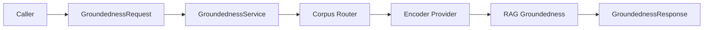
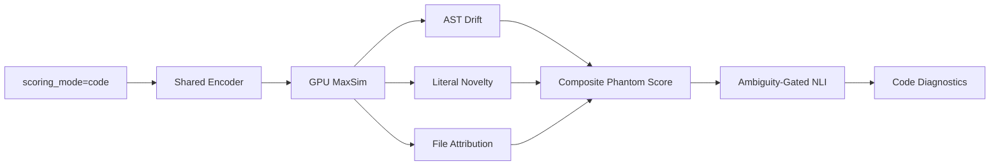
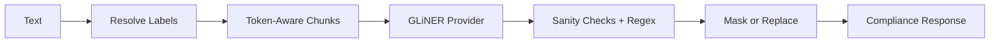
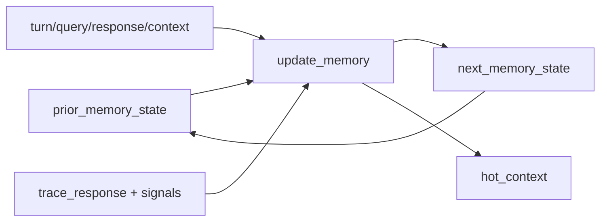
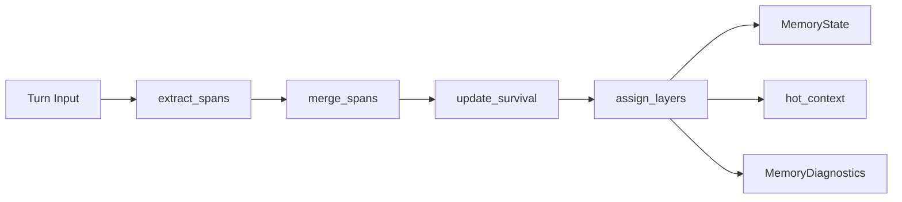

# Latence TRACE Production Engineering Briefing

This document is the baseline handoff for engineering teams preparing
`latence-trace` for commercial production. It explains what the product does,
which APIs are public, how stateless and stateful flows differ, how models are
orchestrated, what is launch-ready now, and which operational decisions must be
made before a customer-facing deployment.

The intended readers are platform engineers, SDK engineers, SREs, product
engineers, and security/compliance reviewers.

## 1. Executive Summary

`latence-trace` is the Latence TRACE runtime: an enterprise AI compliance and
verification service for real-time groundedness scoring, coding-agent drift
detection, PII redaction, memory compression, stateful session repair, and
auditable runtime decisions.

At production level, TRACE offers five major product surfaces:

1. **RAG groundedness**: verifies an LLM response against caller-supplied
   context and returns calibrated `green` / `amber` / `red` risk bands,
   per-token signals, support-unit attribution, NLI diagnostics, structured
   source checks, and heatmap-ready payloads.
2. **Code groundedness and drift**: scores agentic coding turns with MaxSim,
   AST drift, literal novelty, ambiguity-gated NLI, semantic entropy, a
   calibrated composite phantom score, and per-file attribution.
3. **PII redaction and compliance**: detects canonical GDPR-oriented labels
   through GLiNER, applies deterministic validators and custom regex rules,
   then returns spans or masked/replaced text with privacy-safe usage metadata.
4. **Compression and memory**: compresses text/messages with a managed
   LLMLingua2-style provider or fallback path, and powers InfiniMem state
   updates with survival scoring, deduplication, adaptive budgets, hot/warm/cold
   layers, and exact-critical recall diagnostics.
5. **Stateful TRACE sessions**: stores session state, memory state, source-vault
   records, rollup turns, code session state, generation repair packets, and
   source-backed context for multi-turn agents.

The core runtime is launch-ready as an auditable service when the deployment
topology, license, model endpoints, state backend, and observability stack are
configured deliberately. It already contains the production primitives needed
for a commercial SDK and hosted product:

- Stable Pydantic request/response schemas.
- FastAPI OpenAPI generation and `/agent-help` discovery.
- RunPod all-in-one model orchestration.
- Helm/docker-compose sidecar deployment.
- License middleware, rate limits, request IDs, JSON logs, Prometheus metrics,
  OpenTelemetry hooks, health/readiness probes, and commercial gateway docs.
- Explicit stateless and stateful APIs.
- Runtime policy records with rollback-safe decisions.

The remaining production decisions are not algorithmic blockers; they are
operational choices:

- Choose **RunPod all-in-one** or **FastAPI/Helm sidecar** as the primary
  topology for a given customer or hosted environment.
- Replace the default in-memory session store when sessions must survive
  process restarts, worker rotation, or cross-worker load balancing.
- Decide whether InfiniMem is used as caller-carried stateless memory, server
  session memory, SDK-managed memory, or all three.
- Keep uncalibrated guard models such as GLiNER Guard / Granite Guardian as
  optional shadow or amber signals until tenant-specific evaluation promotes
  them.

## 2. Product Capability Map

| Capability | Product value | Primary API | Core files | Launch stance |
|---|---|---|---|---|
| RAG groundedness | Verify that generated answers are supported by supplied evidence. | `POST /groundedness` | `latence_trace/api/service.py`, `latence_trace/core/groundedness.py`, `latence_trace/core/nli.py` | Launch-ready. |
| Code groundedness | Detect invented symbols, code drift, unsupported edits, and context waste in coding agents. | `POST /groundedness` with `scoring_mode="code"` | `latence_trace/core/code_lane/orchestrator.py`, `ast_grounding.py`, `literal_novelty.py`, `file_attribution.py` | Launch-ready with tree-sitter grammars installed. |
| PII redaction | Detect and redact GDPR/enterprise PII before text leaves trust boundaries. | `POST /v1/compliance/redact` | `latence_trace/api/compliance_service.py`, `latence_trace/compliance/*` | Launch-ready with GLiNER endpoint configured. |
| Compression | Reduce memory/context cost while preserving exact structural tokens, numbers, code, Markdown, tables. | `POST /v1/compression` | `latence_trace/api/compression_service.py`, `latence_trace/api/compression_models.py` | Launch-ready with managed provider; fallback available for dev. |
| InfiniMem | Maintain hot/warm/cold agent memory with survival scores and adaptive budgets. | `POST /v1/memory/update` or sessions | `latence_trace/memory/*` | Launch-ready as memory service; enforcement should follow quality gates. |
| Stateful sessions | Stateful wrapper over core TRACE, memory, source vault, repair, rollups. | `/v1/trace/sessions/*` | `latence_trace/sessions/*` | Launch-ready for single-process/default; production persistence requires store decision. |
| Source-vault repair | Retrieve bounded original excerpts when compressed memory lacks critical terms. | `POST /v1/trace/sessions/{id}/repair` and automatic session scoring | `latence_trace/sessions/service.py` | Launch-ready as bounded repair packet mechanism. |
| Runtime decision | Convert scores into `allow`, `auto_repair`, or `block` records under a versioned policy. | Included in `GroundednessResponse` | `latence_trace/core/runtime_decision.py`, data policy JSON | Launch-ready and rollback-safe. |
| Amber escalation | Optional LLM judge for amber RAG cases. | `auto_decide` in request | `latence_trace/middleware/amber_escalation.py` | Opt-in; cost and provider policy required. |
| Gateway / SaaS controls | API keys, tenant thresholds, rate limits, metering, billing exports. | Cloudflare Worker paths | `gateway/cloudflare/*` | Commercial edge layer ready with environment-specific configuration. |
| MCP | Agent-facing remote/stdin integration for tool use. | `/mcp/*` when enabled | `latence_trace/mcp/*` | Optional. |

## 3. Public API Surface Reference

The canonical FastAPI app is built in `server/main.py`. It mounts routers for:

- Metrics.
- Core groundedness and discovery.
- Compliance twice: `/compliance/*` and `/v1/compliance/*`.
- Compression.
- Memory.
- Stateful TRACE sessions.
- Optional MCP HTTP.

### 3.1 Core Groundedness

Defined in `latence_trace/api/routes.py`.

| Method | Path | Request model | Response model | State |
|---|---|---|---|---|
| `POST` | `/groundedness` | `GroundednessRequest` | `GroundednessResponse` | Stateless scoring. |
| `POST` | `/groundedness/rollup` | `RollupRequest` | `RollupResponse` | Stateless aggregation. |
| `GET` | `/health` | None | `{"status": "ok"}` | Liveness alias. |
| `GET` | `/healthz` | None | `{"status": "ok"}` | Liveness. |
| `GET` | `/readyz` | None | readiness JSON | Warmup gate. |
| `GET` | `/agent-help` | None | agent discovery JSON | SDK/agent self-description. |
| `GET` | `/.well-known/ai-plugin.json` | None | plugin descriptor | Agent tooling. |

`POST /groundedness` supports three premise lanes:

- `chunk_ids`: production fast path when the host owns a chunk resolver/vector
  store.
- `raw_context`: compatibility path where TRACE segments and encodes raw text.
- `support_units[]`: structured, multi-source premise path with stable
  per-unit attribution.

The same endpoint handles RAG and code. The lane is selected with
`scoring_mode`:

- Omitted or `"rag"`: RAG groundedness.
- `"code"`: code lane with AST/literal/drift diagnostics.

### 3.2 Compliance / PII

Defined in `latence_trace/api/compliance_routes.py` and mounted at both
`/compliance` and `/v1/compliance`.

| Method | Path | Request model | Response model | State |
|---|---|---|---|---|
| `POST` | `/v1/compliance/redact` | `ComplianceRedactionRequest` | `ComplianceRedactionResponse` | Stateless. |
| `GET` | `/v1/compliance/schema` | None | schema metadata | Stateless. |
| `GET` | `/v1/compliance/healthz` | None | provider readiness | Stateless. |

The request supports:

- `mode="open"` for all canonical GDPR labels.
- `mode="category"` with `categories`.
- Explicit `labels`.
- `threshold`.
- `redact=true`.
- `redaction_mode="mask"` or `"replace"`.
- Custom regex labels through `custom_labels`.
- `include_original_text=false` for safer response handling.

The service resolves canonical labels, maps to GLiNER-facing aliases, runs
token-aware chunking, calls the GLiNER provider, applies recall-preserving
boundary cleanup plus advisory format metadata, merges custom regex entities,
deduplicates overlaps, and optionally redacts text.

### 3.3 Compression

Defined in `latence_trace/api/compression_routes.py`.

| Method | Path | Request model | Response model | State |
|---|---|---|---|---|
| `POST` | `/v1/compression` | `CompressionRequest` | `CompressionResponse` | Stateless. |

The current compression request defaults are production-conservative:

- `target_token_ratio=0.6`, equivalent to 40 percent removal when
  `compression_rate` is not supplied.
- `compression_rate` overrides the target ratio and uses SuperPod semantics:
  fraction of tokens to remove.
- `force_preserve_digit=true`.
- Structural `preserve_tokens` for code fences, inline code, Markdown headings,
  Markdown lists, and tables.
- `auto_preserve_structural_tokens=true`.
- `apply_toon=true` and `toon_encoding=true`.
- `target_compression=0.4` for message compression.
- `max_compression=0.9` for oldest compressible messages.

Provider behavior:

- With `LATENCE_TRACE_COMPRESSION_ENDPOINT`, `CompressionService.from_env()`
  uses `VllmCompressionProvider`.
- Without a provider, local/dev falls back to sentence-preserving compression.
- If a managed provider is configured and fails, the service raises
  `CompressionProviderError` unless provider fallback is explicitly enabled.

### 3.4 Memory Update

Defined in `latence_trace/api/memory_routes.py`.

| Method | Path | Request model | Response model | State |
|---|---|---|---|---|
| `POST` | `/v1/memory/update` | `MemoryUpdateRequest` | `MemoryUpdateResponse` | Caller-carried state. |

This route is stateless at the server layer. The caller sends
`prior_memory_state`; TRACE returns `next_memory_state`. SDKs should round-trip
the returned memory state exactly, without trying to edit internal span fields.

### 3.5 Stateful TRACE Sessions

Defined in `latence_trace/sessions/routes.py`.

| Method | Path | Request model | Response model |
|---|---|---|---|
| `POST` | `/v1/trace/sessions` | `TraceSessionCreateRequest` | `TraceSessionCreateResponse` |
| `GET` | `/v1/trace/sessions/{session_id}` | None | `TraceSessionGetResponse` |
| `POST` | `/v1/trace/sessions/{session_id}/events` | `TraceSessionEventRequest` | `TraceSessionEventResponse` |
| `POST` | `/v1/trace/sessions/{session_id}/score` | `TraceSessionScoreRequest` | `TraceSessionScoreResponse` |
| `POST` | `/v1/trace/sessions/{session_id}/memory/update` | `TraceSessionEventRequest` | `TraceSessionEventResponse` |
| `GET` | `/v1/trace/sessions/{session_id}/context` | None | `TraceSessionContextResponse` |
| `GET` | `/v1/trace/sessions/{session_id}/sources/{source_id}` | `include_raw` query | `TraceSessionSourceResponse` |
| `POST` | `/v1/trace/sessions/{session_id}/sources/{source_id}` | `TraceSessionSourceRequest` | `TraceSessionSourceResponse` |
| `POST` | `/v1/trace/sessions/{session_id}/repair` | `TraceSessionRepairRequest` | `TraceSessionRepairResponse` |
| `POST` | `/v1/trace/sessions/{session_id}/rollup` | `TraceSessionRollupRequest` | `TraceSessionRollupResponse` |
| `DELETE` | `/v1/trace/sessions/{session_id}` | None | `TraceSessionCloseResponse` |

Default session state is held by `InMemorySessionStore` inside
`TraceSessionService`. This is correct for local runs, tests, and single-worker
RunPod actions. For commercial stateful deployments that need restart survival,
cross-worker routing, or strict retention controls, the `SessionStore` protocol
is the persistence boundary to implement.

### 3.6 Optional MCP

When `LATENCE_TRACE_ENABLE_MCP_HTTP` is enabled, MCP routes under `/mcp/*` are
mounted from `latence_trace/mcp/remote.py`. MCP is the agent-tooling layer for
remote clients and should receive tenant context from the gateway.

## 4. Stateless Runtime Flows

Stateless flows are the right default for thin SDK primitives. They are
idempotent at the service layer and scale horizontally without sticky sessions.

### 4.1 Stateless RAG Scoring

The caller sends `query_text`, `response_text`, and evidence through
`raw_context`, `support_units`, or `chunk_ids`. TRACE segments evidence,
encodes query/context/response, computes reverse-context MaxSim, applies
literal and structured guards, optionally runs NLI/reranker/atomic verification,
fuses channels, classifies risk, and returns evidence plus diagnostics.

Important properties:

- Closed-book by default. No premise means no fabricated certainty.
- Multi-language stopwords and null-bank calibration support English and
  German.
- Structured source verification handles JSON / tables / schema-shaped sources.
- The response includes rich diagnostics, not just one score.

### 4.2 Stateless Code Scoring

The code lane reuses the shared encoder path and layers code-specific checks:

- AST symbol extraction through tree-sitter with regex fallback.
- Literal novelty and missing identifiers.
- Phantom symbols, phantom imports, class/function drift.
- Per-file ownership and dead-weight context detection.
- Ambiguity-gated NLI cascade instead of unconditional heavy verification.
- Optional semantic entropy.
- Composite phantom score and reason-code histogram.

The code path is designed for IDE and agentic coding workflows: Cursor, Claude
Code, Codex, OpenCode, aider, and similar systems.

### 4.3 Stateless PII Redaction

The compliance API is safe to expose as a standalone product feature. The
gateway and portal should meter only aggregate counts, labels, mode, latency,
and errors, never raw request text, entity text, replacement values, or
redacted output.

### 4.4 Stateless Compression

Compression can be used by SDKs, memory ingestion, and standalone customers.
The managed path runs a SuperPod-compatible LLMLingua2-style provider:

1. Optional TOON encoding for JSON-like payloads.
2. Token-aware chunking.
3. Token-classification keep probabilities from vLLM.
4. Fast postprocessing with digit and force-token preservation.
5. Backfill for force tokens the model still drops.

The fallback path is intentionally conservative and mainly for local/dev.

### 4.5 Caller-Carried Memory

`POST /v1/memory/update` keeps the server stateless:

This is ideal for SDKs that want deterministic client-managed memory. It is
also the easiest path for customers who cannot allow server-side persistence.

## 5. Stateful TRACE Sessions

Stateful sessions are the higher-level product surface for long-running agents.
They combine:

- Core TRACE scoring.
- InfiniMem memory state.
- Code session state.
- Source-vault records.
- Repair packets.
- Context-for-generation.
- Rollup records.

### 5.1 Session Lifecycle

1. `POST /v1/trace/sessions` creates a `TraceSessionState`.
2. `POST /events` appends user messages, assistant responses, tool results,
   file reads, retrieval results, code diffs, decisions, and constraints.
3. Each event updates memory through `update_memory`.
4. Each event is also stored as an immutable source record for repair.
5. `POST /score` constructs a groundedness request, injects session state,
   memory state, hot context, and generation repair context when needed.
6. Score responses update code session state, memory state, rollup turns, and
   repair diagnostics.
7. `GET /context` returns the current hot context plus repair context.
8. `POST /repair` builds a bounded source-vault packet manually.
9. `POST /rollup` aggregates session turns.
10. `DELETE /{session_id}` marks a session closed.

### 5.2 Source Vault and Repair

`TraceSessionService` writes source records for events and synthetic trace
payloads. Source records are immutable by `source_id` and content hash.

Repair has two forms:

- **Pre-generation repair**: if memory diagnostics or missing critical terms
  indicate risk, the service builds a generation packet and combines hot memory
  with bounded source-vault excerpts.
- **Post-score repair**: if runtime decisions, missing terms, low support, or
  other triggers fire after scoring, the service returns a repair packet with
  suggested action.

Repair packets include:

- Triggers.
- Severity.
- Matched/missing terms.
- Excerpts.
- Suggested action: `none`, `re_score`, `ask_tool_again`, or
  `block_until_regrounded`.

The production design is bounded and auditable: repair pulls from original
source records, not from lossy summaries alone.

### 5.3 Production Persistence Boundary

`SessionStore` is a protocol with methods for sessions, events, sources, and
lookups. The default `InMemorySessionStore` is process-local.

For production stateful sessions, engineers should implement one of:

- Redis/Postgres session store for hosted multi-worker deployments.
- Customer-owned persistence store for self-hosted regulated environments.
- SDK-managed state using `/v1/memory/update` when server persistence is not
  allowed.

Sticky sessions can be a temporary bridge for RunPod, but they are not a
substitute for durable session storage when customers expect continuity across
worker replacement.

## 6. InfiniMem Memory Management

InfiniMem lives under `latence_trace/memory/`. Its public state model is
`MemoryState(version="infinimem.v1")`. The core update pipeline is:

### 6.1 Span Model

Each `SpanRecord` contains:

- Stable `id`.
- Text.
- `span_type`: goal, constraint, decision, evidence, code symbol, code fragment,
  error, tool result, retrieval chunk, summary, filler.
- Layer: hot, warm, cold, tombstone.
- Compression level: exact, extractive, summary, fact, tombstone.
- Signature: hashes, typed keys, identifiers, file paths, symbols, numbers,
  dates, rare terms.
- Scores: salience, relevance, attribution, redundancy, dead weight, staleness,
  exact-critical score, survival value, learned survival, horizon, decay
  pressure.
- Provenance and source pointers.

### 6.2 Policy Model

`MemoryPolicy` supports fixed, ratio, and adaptive budget modes:

- `hot_token_budget`.
- `warm_token_budget`.
- `memory_budget_mode`.
- `context_window_tokens`.
- `memory_context_ratio`.
- `target_token_reduction`.
- `min_exact_critical_recall`.
- `min_survival_mass`.
- `recent_tail_token_budget`.
- `genesis_anchor_turns`.
- `genesis_anchor_score_floor`.
- Domain-specific horizons.

The default mode is adaptive. Adaptive budget selection tries to use the
smallest budget that still satisfies quality gates. This matters because long
agent traces are normal in production: TRACE must save tokens without destroying
first-turn goals, constraints, exact IDs, file paths, tool results, or durable
plan context.

### 6.3 Diagnostics

`MemoryDiagnostics` exposes:

- Effective budgets.
- Actual token reduction.
- Estimated exact-critical recall.
- Survival mass retained.
- Whether memory is underbudgeted.
- Recommended hot budget.
- Whether recent tail is required.
- Genesis anchor recall.
- Hot/warm/cold/removed tokens.
- Timings.
- Top survival causes.

SDKs should surface a subset of these diagnostics to developers and should
log the full diagnostics in debug/audit modes.

## 7. Groundedness Engine: RAG

The RAG stack is primarily in `latence_trace/core/groundedness.py`,
`latence_trace/core/nli.py`, `latence_trace/core/structured.py`, and
`latence_trace/api/service.py`.

### 7.1 Signals

The RAG lane fuses:

- Reverse-context MaxSim.
- Calibrated reverse-context score against a multilingual null bank.
- Literal guardrails for dates, numbers, units, currencies, URLs, identifiers.
- NLI aggregate.
- Atomic claim verification.
- Cross-encoder premise reranking.
- Semantic entropy, when enabled.
- Structured-source verification for JSON, markdown tables, and structured
  evidence.
- Context coverage and support-unit usage.

### 7.2 Corpus Routing

`GroundednessService` runs the corpus router before scoring. The request can
declare `corpus_type`, or the router can infer a class. The response may include
`corpus_route`.

Corpus classes include:

- `rag.prose.enterprise`.
- `rag.prose.short_factoid`.
- `rag.prose.multi_claim`.
- `rag.structured`.
- `rag.code_in_context`.
- `code.agentic_trace`.

This enables class-specific calibration bundles, thresholds, and runtime
policies.

### 7.3 Risk Bands and Decisions

`GroundednessResponse.scores.risk_band` is the score-level result.
`runtime_decision` is the policy-level result. Engineers should not conflate
them:

- Risk band says how the evidence score classifies.
- Runtime decision says what the product should do: allow, auto-repair, or
  block, under a versioned policy.

## 8. Groundedness Engine: Code and Drift

The code lane is built in `latence_trace/core/code_lane/`.

### 8.1 Components

| Component | File | Purpose |
|---|---|---|
| Orchestrator | `orchestrator.py` | Coordinates all code-lane signals. |
| GPU scorer | `gpu_scorer.py` | MaxSim-like support scoring. |
| AST grounding | `ast_grounding.py` | Extract symbols and detect phantom/drift. |
| Literal novelty | `literal_novelty.py` | Detect unsupported identifiers/literals. |
| NLI cascade | `nli_cascade.py` | Verify ambiguous cases only. |
| Composite | `composite.py` | Logistic/linear composite phantom score. |
| File attribution | `file_attribution.py` | Per-file ownership, waste, reason codes. |
| Session state | `session_state.py` | Multi-turn rolling code state. |

### 8.2 Code-Lane Contract

Use `GroundednessRequest` with:

- `scoring_mode="code"`.
- `session_id` for multi-turn continuity.
- `response_language_hint` when available.
- `raw_context` or `support_units`.
- `emit_chunk_ownership=true` for richer per-unit output.
- `session_state` if using client-carried code state.

The response can include:

- `code_lane_diagnostics`.
- `file_attribution`.
- `next_session_state`.
- `session_signals`.
- `heatmap`.
- `runtime_decision`.

### 8.3 Production Requirements

The code lane is production-ready when:

- Tree-sitter grammars are installed for supported languages.
- Regex fallback counters stay at zero for supported languages.
- NLI cascade endpoints are reachable when enabled.
- Per-lane concurrency is tuned to avoid starving RAG or code traffic.

RunPod health includes code-lane grammar state through `_code_lane_health()`.

## 9. Compression Service

Compression is both a standalone API and an internal memory-support service.

### 9.1 Request Modes

`CompressionRequest.action` can be:

- `compress`: compress one text payload.
- `compress_messages`: compress chat-style messages.

For messages, system messages are preserved. Other messages use cosine-annealed
compression rates from `target_compression` to `max_compression`.

### 9.2 Preservation Strategy

The current defaults preserve production-critical material:

- Digits.
- Exact `force_tokens`.
- `preserve_exact`.
- Code paths.
- Code-like symbols.
- Inline code.
- Markdown headings/lists.
- Markdown table rows.
- Code fences.

The postprocessor also attempts to restore missing force-token carrier
sentences if the model drops a required exact token.

### 9.3 Deployment

Compression can run:

- As an external endpoint set with `LATENCE_TRACE_COMPRESSION_ENDPOINT`.
- As a managed RunPod vLLM server when enabled.
- As local fallback in dev/test.

Production should prefer managed provider mode for deterministic behavior and
should decide explicitly whether provider fallback is acceptable for a given
tenant.

## 10. PII Redaction and Compliance

The compliance service is a product surface, not a side-effect of groundedness.
It is intentionally separate from RAG/code scoring.

### 10.1 Label Model

Public labels are canonical GDPR-oriented labels from
`latence_trace/compliance/labels.py`. The service maps them to model aliases
before GLiNER inference and maps predictions back to canonical labels before
returning results.

This keeps customer contracts stable while allowing model-facing prompt labels
to be optimized.

### 10.2 Runtime Pipeline

1. Validate request.
2. Resolve categories/labels.
3. Translate canonical labels to GLiNER aliases.
4. Chunk text with tokenizer-aware limits.
5. Run GLiNER provider per chunk in a bounded thread pool.
6. Offset chunk-local spans back to global positions.
7. Canonicalize labels.
8. Clean boundaries and annotate advisory sanity-check failures.
9. Add custom regex entities.
10. Deduplicate overlapping spans by source, score, and length.
11. Mask or replace text when requested.
12. Return spans, redacted text, timings, usage metadata.

### 10.3 Privacy Requirements

Compliance logs and gateway analytics must never include raw text, entity text,
replacement values, or redacted output. Meter only aggregate counts and labels.

## 11. Runtime Decisions, Amber Escalation, and Repair

### 11.1 Runtime Decisions

`latence_trace/core/runtime_decision.py` converts score records into product
actions:

- `allow`.
- `auto_repair`.
- `block`.

The decision is rollback-safe:

- Enabled by default unless `LATENCE_TRACE_RUNTIME_DECISION_ENABLED=0`.
- Policy loaded from `LATENCE_TRACE_RUNTIME_POLICY_PATH` or packaged default.
- Head registry loaded from `LATENCE_TRACE_RUNTIME_HEAD_REGISTRY_PATH` or
  packaged default.
- Policy SHA256 is included in the response.
- Missing policy degrades conservatively to `auto_repair`.

### 11.2 Amber Escalation

Amber escalation is optional and off by default. It is controlled by
`LATENCE_TRACE_AUTO_DECIDE_ENABLED`, `LATENCE_TRACE_AUTO_DECIDE_PROVIDER`, model
and API-key environment variables.

It sends a bounded, evidence-only judge payload to an LLM provider or to the
offline heuristic provider. This is useful for pilots and high-stakes amber
cases, but it introduces cost and external-provider policy decisions.

### 11.3 Repair

Repair is the native mitigation layer for cases where compressed memory or
support evidence is insufficient. In stateful sessions, repair uses the source
vault to fetch bounded excerpts and returns a generation-ready context.

Production policy:

- Let TRACE block or repair on missing exact critical terms.
- Never let uncalibrated guard models override a red/repair TRACE decision.
- Treat guard-model `unsafe` results as additive amber/risk signals until
  calibrated.

## 12. Model Deployment and vLLM Orchestration

There are two production topologies.

### 12.1 RunPod All-In-One Worker

`runpod/handler.py` starts the RunPod serverless worker. It can launch managed
vLLM subprocesses for:

- ColBERT encoder.
- NLI model.
- Compliance GLiNER.
- Compression.

`runpod/server.py` wraps each subprocess with:

- `vllm serve`.
- Localhost binding.
- Plugin registration through `VLLM_PLUGINS`.
- `/health` polling.
- Startup timeout.
- GPU load phase coordination.
- Log streaming.

RunPod defaults:

- Profile: `quality`.
- Max concurrency: `64`.
- ColBERT model: `lightonai/LateOn`.
- NLI model: `MoritzLaurer/mDeBERTa-v3-base-xnli-multilingual-nli-2mil7`.
- Compliance model: `knowledgator/gliner-pii-large-v1.0`.
- Compression model: local vendored model if complete, else
  `latence/compression-v0.1`.
- Ports: ColBERT 8001, NLI 8002, compliance 8003, compression 8004.

The health payload exposes server health, model runtime config, code-lane
grammar state, profile, version, service device, and max concurrency.

### 12.2 FastAPI / Helm Sidecar

The root `Dockerfile`, `docker-compose.yaml`, and Helm chart describe a
sidecar-oriented deployment:

- FastAPI app runs `python -m server.main`.
- Encoder runs as a separate vLLM-Factory service.
- `/readyz` gates traffic after warmup.
- `/metrics` exposes Prometheus metrics.
- License middleware and rate limits run in-process.
- Kubernetes deployment can use non-root user, read-only filesystem, HPA,
  ServiceMonitor, NetworkPolicy, PDB, and Secrets.

The default Docker/compose profile is `balanced`, not RunPod's `quality`.

### 12.3 Gateway Topology

The Cloudflare Worker in `gateway/cloudflare/` fronts hosted/SaaS deployments:

- API key verification.
- Key rotation and revocation.
- Per-tenant thresholds via KV.
- Durable Object token-bucket rate limits.
- Usage metering in Analytics Engine and D1.
- Stripe usage export.
- Compliance route forwarding.
- MCP proxying.

The gateway path map must be kept aligned with the origin deployment. Vanilla
FastAPI exposes `POST /groundedness`; the gateway docs refer to
`POST /v1/groundedness/score`, so production routing must either rewrite paths
or point at a RunPod/origin contract that supports the gateway shape.

## 13. RunPod Production Worker

RunPod is best for hosted GPU execution where one worker owns local model
subprocesses.

### 13.1 Actions

The handler supports:

- Default score action.
- Rollup.
- Compliance redaction.
- Compression.
- `memory.update`.
- `session.*` / `trace_session`.
- `_health` synthetic input.

### 13.2 Concurrency

RunPod uses:

- Global worker concurrency from `max_concurrency`.
- Per-lane semaphores for RAG and code.
- Separate compliance semaphore.
- ThreadPoolExecutor for blocking service calls.

Operators can tune:

- `LATENCE_TRACE_RAG_CONCURRENCY`.
- `LATENCE_TRACE_CODE_CONCURRENCY`.
- Request timeout environment variables.
- Per-model GPU memory fractions.

### 13.3 Startup

Startup does:

1. Build config.
2. Prepare GLiNER model for vLLM if needed.
3. Apply profile.
4. Build managed servers.
5. Start vLLM subprocesses.
6. Export endpoint/model environment variables.
7. Build services.
8. Warm kernels and prime runtime.
9. Create session service.
10. Mark initialized.

This is production-grade, but cold-start planning matters. Hosted deployments
should keep warm workers per profile.

## 14. FastAPI / Helm / Gateway Deployment

### 14.1 FastAPI

FastAPI is the cleanest topology for customer self-hosting and standard
Kubernetes.

Use this when:

- Customer wants `/metrics`.
- Customer wants their own HPA and ServiceMonitor.
- Customer runs encoder/NLI as external model services.
- Customer needs stricter container hardening.

### 14.2 Helm

The Helm chart is production-oriented:

- Non-root.
- Read-only root filesystem.
- Service account without automount token.
- Optional HPA.
- Optional NetworkPolicy.
- Optional ServiceMonitor.
- Optional Ingress.
- License Secret support.
- PDB.

Before customer go-live, use `docs/operations/deployment-checklist.md`.

### 14.3 Gateway

The gateway is the commercial SaaS control plane. It should own:

- Tenant API keys.
- Tenant quotas.
- Tenant thresholds.
- Tenant rate limits.
- Billing usage.
- Edge logs.
- Request authentication.

The Python TRACE service should remain focused on scoring, compliance,
compression, memory, and session semantics.

## 15. Observability, Logging, Metrics, and Audit Records

### 15.1 Metrics

FastAPI exposes `GET /metrics` through `latence_trace/observability/metrics.py`.

Important metrics:

- `latence_trace_requests_total`.
- `latence_trace_request_duration_seconds`.
- `latence_trace_request_inflight`.
- `latence_trace_encode_seconds`.
- `latence_trace_score_seconds`.
- `latence_trace_nli_seconds`.
- `latence_trace_score`.
- `latence_trace_active_profile`.
- `latence_trace_license_days_until_expiry`.
- `latence_trace_build_info`.
- Code-lane counters for lane requests, cascade fires, budget events, phantom
  verdicts, AST parser failures, and regex fallback.

RunPod increments some of the same counters but does not expose FastAPI
`/metrics` unless wrapped by an additional HTTP exporter. Hosted RunPod
observability therefore needs gateway logs, RunPod platform metrics, and/or a
separate metrics exposure decision.

### 15.2 Logs

`LATENCE_TRACE_LOG_FORMAT=json` switches to structured logs with:

- Timestamp.
- Level.
- Logger.
- Message.
- Request ID.
- OpenTelemetry trace/span IDs when active.
- `extra` fields.

`RequestIdMiddleware` echoes or generates `x-request-id` for correlation.

### 15.3 Audit Records

RunPod scoring can emit append-only audit records when
`LATENCE_TRACE_AUDIT_LOG_DIR` is set. The audit writer is explicitly designed to
avoid blocking the hot path.

Audit policy should define:

- Which tenants require audit.
- Retention period.
- Encryption/storage location.
- Whether raw payload fields are allowed or must be redacted.

### 15.4 Alerts

Day-one alerts should cover:

- p95 latency.
- 5xx error rate.
- License expiry.
- 429/rate-limit spikes.
- Active profile drift.
- Tree-sitter fallback on supported code languages.
- RunPod cold-start/health failures.
- Compliance provider unavailability.

## 16. Security, Licensing, Rate Limits, and Commercial Controls

### 16.1 License Middleware

`LicenseMiddleware` enforces a signed JWT license unless
`LATENCE_TRACE_LICENSE_REQUIRE=false`. Exempt paths include health, metrics,
docs, OpenAPI, `/agent-help`, and the plugin descriptor.

Successful license claims are attached to `request.state.license` for rate
limits, metrics, and feature gates.

### 16.2 Rate Limits

`RateLimitMiddleware` uses an in-process token bucket:

- Keyed by license subject when licensed.
- Falls back to client IP in dev.
- Honors `license.max_qps`.
- Can also use `LATENCE_TRACE_RATE_LIMIT_RPS`.
- Returns 429 with `Retry-After`.

For multi-worker or SaaS deployments, global rate limiting belongs at the
gateway layer because in-process buckets are per worker.

### 16.3 Commercial Gateway

Cloudflare gateway owns:

- API keys.
- Per-tenant quota.
- Rate limits.
- Tenant threshold injection.
- Metering.
- Key rotation/revocation.
- Billing export.

### 16.4 Privacy Posture

Production logging rules:

- Do not log raw PII.
- Do not log entity text in compliance analytics.
- Hash or omit user-provided session identifiers where possible.
- Keep source-vault access behind explicit `include_raw` controls.
- For sessions, document privacy modes: `standard`, `redacted`,
  `metadata_only`.

## 17. SDK Design Implications

The thin SDK should be built around five stable concepts.

### 17.1 Stateless Score Client

Expose:

- `score_rag(query, response, context|support_units|chunk_ids, ...)`.
- `score_code(query, response, files/support_units, session_state=None, ...)`.

Return typed response objects but keep access to raw JSON for forward
compatibility.

### 17.2 Compliance Client

Expose:

- `redact(text, labels=None, categories=None, redact=True, mode="mask")`.
- `schema()`.
- `health()`.

Default to not returning `original_text` when customers choose safer settings.

### 17.3 Compression Client

Expose:

- `compress(text, compression_rate=None, preserve_exact=None)`.
- `compress_messages(messages, target_compression=0.4, max_compression=0.9)`.

Surface `preserved_terms`, `tokens_saved`, and provider diagnostics.

### 17.4 Memory Client

Expose caller-carried state:

- `memory = TraceMemoryState.empty()`.
- `memory, hot_context, diagnostics = client.memory_update(memory, turn, ...)`.

Do not hide diagnostics; they are key to debugging compression quality.

### 17.5 Session Client

Expose:

- `create_session`.
- `append_event`.
- `score_session`.
- `context`.
- `repair`.
- `rollup`.
- `close`.

SDK docs must explain that default server sessions are process-local unless the
deployment has a durable session store.

### 17.6 Error Handling

The SDK should normalize:

- Groundedness/compliance structured envelopes:
  `{code, message, hint, docs_url}`.
- Session route string errors.
- 429 `Retry-After`.
- License errors.
- Provider health errors.

### 17.7 Retries

Retry only safe idempotent calls by default:

- `GET` routes.
- Stateless score calls only when caller provides idempotency/request IDs and
  can tolerate duplicate scoring.
- Session events only when `idempotency_key` is set.

## 18. Launch-Readiness Checklist

### 18.1 Product Readiness

- [ ] RAG groundedness enabled and calibrated for the tenant profile.
- [ ] Code lane enabled only when tree-sitter grammars are present.
- [ ] Compliance GLiNER endpoint healthy.
- [ ] Compression provider configured if production compression is offered.
- [ ] Runtime decision policy path present and policy SHA visible in responses.
- [ ] Amber escalation explicitly on/off per tenant.
- [ ] Guard model signals, if any, kept additive and shadow/amber until
      calibrated.

### 18.2 Deployment Readiness

- [ ] Topology selected: RunPod all-in-one or FastAPI/Helm sidecar.
- [ ] Model IDs pinned.
- [ ] Model cache/warm strategy defined.
- [ ] `/readyz` or RunPod `_health` checked by orchestration.
- [ ] Concurrency tuned after load testing.
- [ ] License JWT installed.
- [ ] Rate limiting configured at gateway or middleware.
- [ ] NetworkPolicy/egress policy configured.
- [ ] Secrets managed through Secret/Vault, not plain Git.

### 18.3 Stateful Readiness

- [ ] Decide whether sessions are allowed in production.
- [ ] If yes, implement durable `SessionStore` or enforce sticky single-worker
      semantics.
- [ ] Retention policy defined.
- [ ] Source-vault raw access policy defined.
- [ ] Privacy mode defaults chosen.
- [ ] SDK documents client-carried memory vs server-held sessions.

### 18.4 Observability Readiness

- [ ] JSON logs enabled.
- [ ] Request IDs propagated.
- [ ] Prometheus scrape configured for FastAPI topology.
- [ ] RunPod metrics/log export strategy defined.
- [ ] OTel endpoint configured if traces are required.
- [ ] Alerts installed.
- [ ] Compliance analytics privacy-reviewed.

### 18.5 Commercial Readiness

- [ ] Gateway route mapping validated against origin routes.
- [ ] Tenant API key lifecycle tested.
- [ ] Usage metering tested.
- [ ] Billing export tested.
- [ ] Customer-facing docs align with selected topology.
- [ ] DPA/SOC/security docs linked in onboarding packet.

## 19. Known Operational Caveats and Required Decisions

### 19.1 RunPod vs FastAPI/Helm

RunPod and Helm are both valid, but they are not the same product topology.

RunPod:

- All-in-one GPU worker.
- Managed local vLLM subprocesses.
- Synthetic `_health`.
- Serverless concurrency model.
- No default FastAPI `/metrics` exposure.

FastAPI/Helm:

- HTTP service with routers and middleware.
- External model sidecars/services.
- `/metrics`, `/healthz`, `/readyz`.
- Kubernetes-native scaling and hardening.

The production briefing for a customer must name the selected topology.

### 19.2 Stateful Sessions

The default store is in-memory. That is acceptable for:

- Local development.
- Tests.
- Single-worker demos.
- Stateless production features.

It is not sufficient for:

- Multi-worker stateful sessions.
- Restart survival.
- Strong retention guarantees.
- Cross-region state.

### 19.3 Gateway Route Alignment

Gateway docs use hosted paths such as `/v1/groundedness/score`. The FastAPI app
exposes `/groundedness`. Production routing must align these through one of:

- Worker rewrite.
- Origin route compatibility.
- SDK base-path configuration.

### 19.4 Profiles Differ by Entry Point

FastAPI/Docker defaults emphasize `balanced`. RunPod handler defaults to
`quality`. This is intentional but must be documented for cost/latency
planning.

### 19.5 Guard Models

Recent qualitative testing showed external guard models should not be treated
as final allow/block gates without calibration. They can be valuable as
additive `unsafe` or amber signals, but a `safe` verdict must not clear a TRACE
repair/block decision.

### 19.6 InfiniMem Enforcement

InfiniMem is ready as a memory and context-management system. For high-stakes
production, enforcement should preserve quality gates:

- Exact-critical recall.
- Survival mass.
- Genesis anchoring.
- Source-vault repair.
- Underbudget diagnostics.

### 19.7 Metrics in RunPod

RunPod increments code counters, but the all-in-one serverless path does not
mount the FastAPI metrics route by default. Hosted observability needs a
RunPod-specific metrics/logging decision.

## 20. File-by-File Engineering Map

### 20.1 Application and API

| File | Role |
|---|---|
| `server/main.py` | FastAPI app factory, middleware, singleton services, router mounting, warmup, JSON logging, tracing. |
| `latence_trace/api/routes.py` | Core `/groundedness`, rollup, health/readiness, agent discovery, amber queue routes. |
| `latence_trace/api/models.py` | Public groundedness and rollup Pydantic contracts. |
| `latence_trace/api/service.py` | Main `GroundednessService`, RAG/code dispatch, profiles, memory/compression integration, runtime decision, amber escalation. |
| `latence_trace/api/compliance_routes.py` | Compliance FastAPI routes. |
| `latence_trace/api/compliance_models.py` | Compliance request/response models. |
| `latence_trace/api/compliance_service.py` | GLiNER redaction orchestration. |
| `latence_trace/api/compression_routes.py` | Compression FastAPI route. |
| `latence_trace/api/compression_models.py` | Compression request/response models. |
| `latence_trace/api/compression_service.py` | LLMLingua2/SuperPod-compatible compression service. |
| `latence_trace/api/memory_routes.py` | Stateless memory update route. |

### 20.2 RAG and Code Core

| File | Role |
|---|---|
| `latence_trace/core/groundedness.py` | RAG score computation, null bank, segmentation, literal/structured/NLI/entropy fusion helpers. |
| `latence_trace/core/nli.py` | NLI verification and fusion logic. |
| `latence_trace/core/structured.py` | Structured source detection and verification. |
| `latence_trace/core/thresholds.py` | Risk-band policies. |
| `latence_trace/middleware/corpus_router.py` | Corpus type routing and calibration selection. |
| `latence_trace/core/code_lane/orchestrator.py` | Code-lane coordination. |
| `latence_trace/core/code_lane/ast_grounding.py` | AST extraction and drift detection. |
| `latence_trace/core/code_lane/literal_novelty.py` | Literal novelty checks. |
| `latence_trace/core/code_lane/nli_cascade.py` | Ambiguity-gated code NLI. |
| `latence_trace/core/code_lane/composite.py` | Code composite phantom scoring. |
| `latence_trace/core/code_lane/file_attribution.py` | File ownership and dead-weight diagnostics. |

### 20.3 Memory and Sessions

| File | Role |
|---|---|
| `latence_trace/memory/models.py` | InfiniMem state, policy, diagnostics, request/response models. |
| `latence_trace/memory/service.py` | High-level memory update pipeline. |
| `latence_trace/memory/extract.py` | Span extraction. |
| `latence_trace/memory/dedup.py` | Span merging/deduplication. |
| `latence_trace/memory/survival.py` | Survival scoring and horizon logic. |
| `latence_trace/memory/select.py` | Hot/warm/cold selection, adaptive budgets, hot context. |
| `latence_trace/memory/signature.py` | Exact critical term/signature extraction. |
| `latence_trace/sessions/models.py` | Stateful session contracts. |
| `latence_trace/sessions/routes.py` | Stateful session routes. |
| `latence_trace/sessions/service.py` | Session store, memory integration, source vault, repair, rollup. |

### 20.4 Deployment and Operations

| File | Role |
|---|---|
| `runpod/handler.py` | RunPod all-in-one worker, actions, concurrency, model env wiring, health payload. |
| `runpod/server.py` | Managed vLLM subprocess manager. |
| `runpod/Dockerfile` | RunPod GPU image and plugin installation. |
| `runpod/start.sh` | RunPod runtime import/plugin smoke and handler start. |
| `Dockerfile` | FastAPI sidecar image. |
| `docker-compose.yaml` | Local sidecar topology with vLLM-Factory encoder. |
| `deploy/helm/latence-trace/README.md` | Kubernetes production chart documentation. |
| `docs/operations/*` | Deployment checklist, observability, calibration, licensing. |
| `gateway/cloudflare/*` | SaaS gateway, tenant auth, metering, rate limits, key lifecycle. |

### 20.5 Security and Commercial

| File | Role |
|---|---|
| `latence_trace/auth/middleware.py` | License middleware and protected-route enforcement. |
| `latence_trace/auth/license.py` | License JWT loading and validation. |
| `latence_trace/middleware/rate_limit.py` | In-process token-bucket limiter. |
| `latence_trace/observability/logging.py` | JSON logging and request ID correlation. |
| `latence_trace/observability/metrics.py` | Prometheus collectors and metrics route. |
| `SECURITY.md` | Security posture and disclosure process. |
| `commercial/*` | Trust center, DPA, SOC mapping, commercial collateral. |

## 21. Launch-Ready Baseline

The system is ready to serve as the commercial baseline for TRACE when deployed
with the required production controls:

- Use `POST /groundedness` for stateless RAG and code scoring.
- Use `/v1/compliance/redact` for PII redaction.
- Use `/v1/compression` for compression.
- Use `/v1/memory/update` for caller-carried InfiniMem.
- Use `/v1/trace/sessions/*` for server-side stateful agents only after
  choosing a session persistence strategy.
- Use RunPod for hosted all-in-one GPU workers or Helm/FastAPI for
  customer-controlled sidecar deployments.
- Put gateway auth, billing, quotas, and tenant thresholds at the Cloudflare
  layer for hosted SaaS.
- Keep runtime decisions policy-versioned and auditable.
- Keep guard-model safety signals additive until calibrated.

This is the right foundation for the next layer: a thin SDK, deployment recipes,
operator runbooks, customer onboarding templates, logging policy, and commercial
usage metering.
